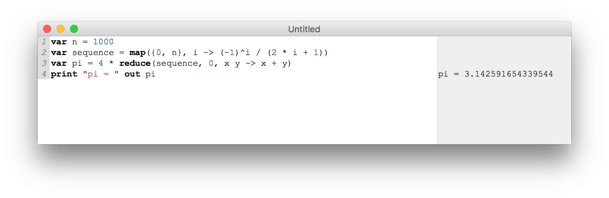

# JetBrains-Interpreter

Interpreter of a simple toy language with the following grammar I created for my internship application at JetBrains
```
expr ::= expr op expr | (expr) | var | { expr, expr } | number |
map(expr, var -> expr) | reduce(expr, expr, var var -> expr)
op ::= + | - | * | / | ^
stmt ::= var identifier = expr | out expr | print “string”
program ::= stmt | program stmt
```

